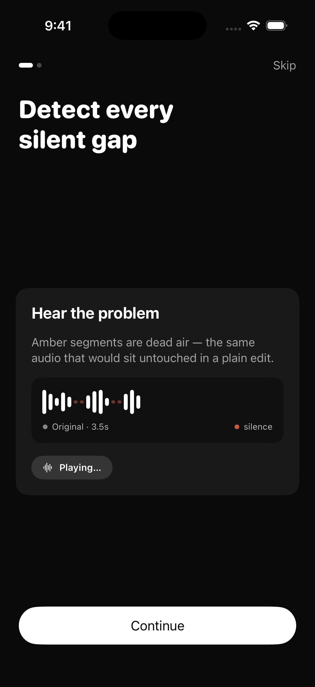
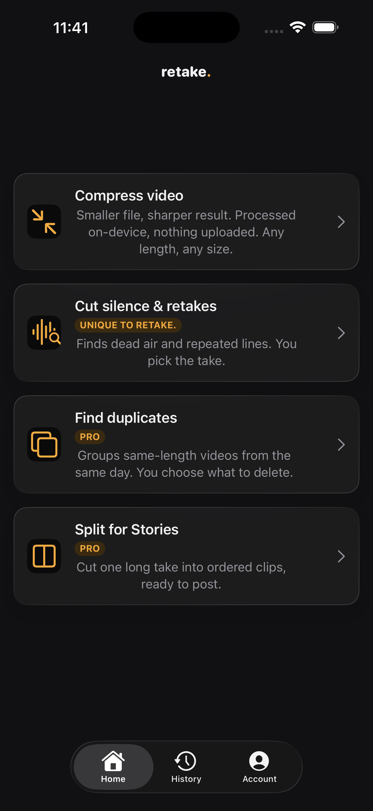
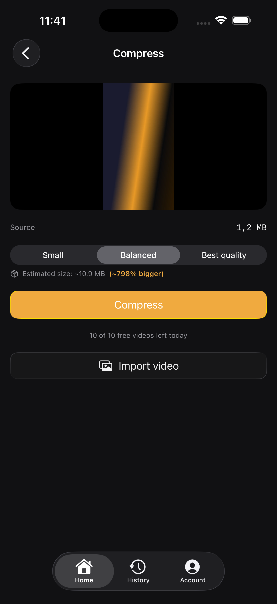
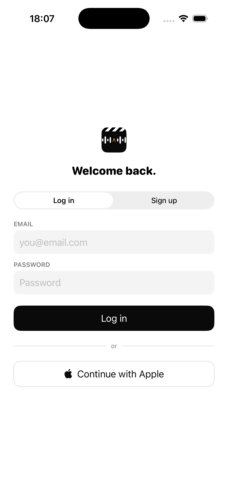
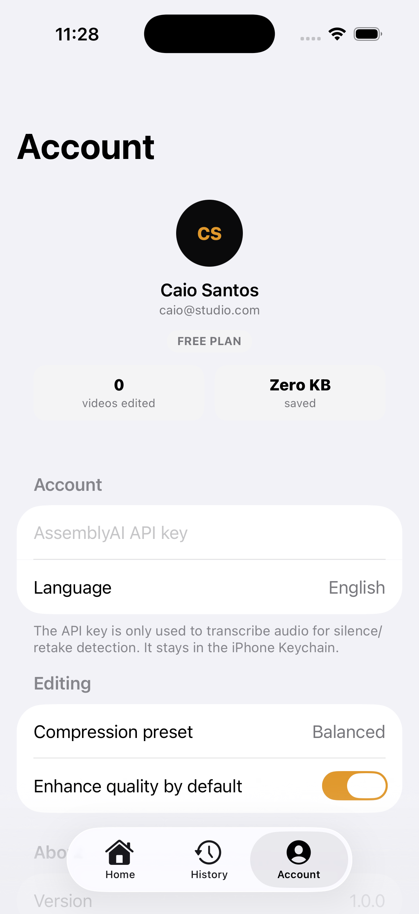

# retake.

[](LICENSE) [](#)

**On-device video compression with AI-powered retake detection.**

## Why this exists

Filming yourself on an iPhone means you almost always stumble a line, say it twice, or leave dead air between sentences — and finding the "good take" in a pile of raw footage afterward is tedious. Most video compressor apps on the App Store are undifferentiated, and the tools that actually catch repeated/re-recorded lines (not just silence) only exist as desktop plugins or web SaaS. `retake.` does both on-device: it shrinks the file and picks out the awkward parts, natively, with no upload step.

## Features

- **On-device video compression** — re-encodes to H.265/HEVC using the iPhone's hardware encoder (`hevc_videotoolbox`), with real-time VideoToolbox mode for faster exports. No upload, no server. Batch mode compresses a whole queue back to back, and shows the estimated size/savings before you commit.
- **Cut silence & retakes** — transcribes the audio, finds silence gaps and repeated phrases, and surfaces a review screen where you pick which take to keep. The app's real differentiator: this kind of retake-aware editing otherwise only exists in desktop plugins or web SaaS, not on iPhone.
- **Split for Stories** — slices one long recording into ordered, fixed-length clips (10–60s) using ffmpeg's segment muxer, no re-encode. Ready-made Stories/Reels posting queue.
- **Find Duplicates** — scans the Photos library for videos with matching length and creation day (the copies Compress and re-imports tend to leave behind), groups them, suggests a keeper, deletes only what you confirm. Public-API-only, entirely on-device.
- **Record with teleprompter** *(bonus, not linked from Home yet)* — native camera capture with an auto-scrolling script overlay, chained into Compress/Cut.
- **Free tier + subscription** — Compress and Cut are free up to 10 videos/day; Find Duplicates and Split for Stories, plus the daily cap, are unlocked by retake. Unlimited ($3.99/mo). All four tools stay usable up to the point of real value (scanning, splitting) before any paywall appears.
- **Native iOS 26 Liquid Glass** — real `.glassEffect()` material (not a recreation) throughout the app on iOS 26+: cards, primary/secondary/destructive buttons, and floating controls like Record's live REC badge. Falls back to the original solid design on iOS 16–25, unchanged.
- **English + Portuguese (BR) localization**, switchable in-app without restarting, plus a light/dark appearance toggle and selectable default compression quality.
- **Real Supabase-backed auth** — Sign in with Apple or email/password, accounts are real, not just local Keychain state. Account deletion is in-app and self-service (Apple 5.1.1(v) compliant), with a working forgot-password flow.
- **Delete original from Photos** (opt-in, before or after compressing) — reclaim storage without losing the source unless you choose to.
- **Local notifications** — get told when a compress/cut/split/batch job finishes instead of watching a progress bar.
- **Local run history** — every job is logged on-device the moment it starts (so an interrupted job shows up as "Interrupted" instead of silently vanishing), with a Photos thumbnail, before/after size, and processing time once it's done.

## Tech stack

- **Swift / SwiftUI**, iOS 16.0+, single Xcode project generated with [XcodeGen](https://github.com/yonaskolb/XcodeGen) from `project.yml`.
- **[ffmpeg-kit-spm](https://github.com/tylerjonesio/ffmpeg-kit-spm)** (pinned `5.1.2`) for on-device encoding and silence detection — the GPL-free build, so hardware `hevc_videotoolbox` is used for encoding rather than `libx264`/`libx265`.
- **AssemblyAI** (optional, bring-your-own-key) for transcription that powers the silence/retake pipeline. The key is pasted by the user in Account settings and stored in the Keychain; it never leaves the device except in the direct API call.
- **PHPickerViewController** for video import — more reliable for large files, and the only way to get an `assetIdentifier` under limited library access.
- No cloud dependency is required for the core features (compression, silence/retake detection, history). Supabase is wired up for auth but the app runs fully without it configured.

## Setup

Requires Xcode 16+ and [XcodeGen](https://github.com/yonaskolb/XcodeGen).

```bash
xcodegen generate
open VideoCompressor.xcodeproj
```

Auth is optional and only needed if you want to wire up a real Supabase backend for the account screen:

```bash
cp VideoCompressor/Secrets.swift.example VideoCompressor/Secrets.swift
# then fill in your own Supabase project URL and anon key
```

`Secrets.swift` is gitignored. Without it configured, the app still builds and runs — compression, history, and the silence/retake pipeline don't touch it.

To build from the command line:

```bash
xcodebuild -project VideoCompressor.xcodeproj -scheme VideoCompressor \
  -destination "generic/platform=iOS" CODE_SIGNING_ALLOWED=NO build
```

To run on a physical device, open the project in Xcode, pick the device, and hit Run — first-run signing needs Xcode's own GUI to create the certificate.

## Screens

Real screenshots, iPhone 17 Simulator, iOS 26.5:

| Onboarding | Home | Compress | Login | Account |
|---|---|---|---|---|
|  |  |  |  |  |

Home, Onboarding, and Compress reflect build 14 — native iOS 26 Liquid Glass and all
four tools (Compress, Cut, Find Duplicates, Split for Stories).

Full visual identity reference (logo, palette, type, and every screen mocked up before implementation) is in `docs/design-mockup.md`.

## Project structure

```
VideoCompressor/
  Theme.swift                Design tokens, wordmark, app mark
  RootView.swift              Splash -> Onboarding -> Auth -> RootTabView
  RootTabView.swift            Home / History / Account tabs
  SplashView.swift / OnboardingView.swift / AuthView.swift
  HomeView.swift
  CompressOnlyView.swift + VideoCompressionService.swift + FFmpegCommandBuilder.swift
  CutOnlyView.swift + EditingPipeline.swift + RetakeReviewView.swift
  SilenceCutPlanner.swift / SilenceDetector.swift / CutRenderer.swift / CutMapper.swift
  TranscriptQA.swift / RetakeCandidate.swift / AssemblyAIClient.swift
  AccountStore.swift / AccountView.swift / HistoryStore.swift / HistoryView.swift
  VideoPicker.swift / PhotoLibrarySaver.swift / APIKeyStore.swift
  SupabaseAuthClient.swift / Secrets.swift.example
VideoCompressorTests/         30 XCTest cases covering the pure-logic pipeline
docs/
  design-mockup.md             Visual identity + screen-by-screen spec
  screenshots/                  Simulator screenshots
```

## Status

Home surfaces all four tools — Compress, Cut silence & retakes, Find Duplicates, Split for Stories, in that order. The build compiles cleanly and all 30 tests pass. Distributed via TestFlight (build 14 as of this writing); the App Store Connect listing (subscription product, review demo account, screenshots) is still being finished.

Record (native camera + teleprompter) stays a bonus feature, implemented and working but not linked from Home yet.

Known limitations:

- Not yet live on the public App Store — TestFlight only while the subscription product and store listing are finalized.
- The delete-original-from-Photos flow and the full cut/retake pipeline haven't been verified end-to-end on a physical device with a real AssemblyAI key yet.

## Version history

| Build | Highlights |
|---|---|
| 14 | Native iOS 26 Liquid Glass extended from primary buttons to every card, secondary/destructive/outlined button, and floating badge app-wide (Home tiles, Record's live camera controls, paywall, batch review screens). |
| 13 | Finished 100% EN/PT localization coverage (Onboarding, Record, Cut review, Auth screens) and fixed a stale string that had silently reverted to English. |
| 12 | Adopted native iOS 26 Liquid Glass on primary CTA buttons; fixed a broken negative-percentage size estimate. |
| 11 | Let free users try Find Duplicates and Split for Stories up to the point of real value before paywalling; redesigned the paywall with real benefits; fixed a History detail layout bug. |
| 10 | Finished full-app EN/PT localization, including counters and plurals; added live elapsed/remaining time to Compress and Cut; confirmed no real max-file-size limit. |
| 9 | Fixed foreground notifications and a silent purchase-load failure; made History resilient to interrupted jobs (shown as "Interrupted" instead of vanishing); shipped functional EN/PT localization. |
| 7 | Added the subscription paywall (10 free Compress/Cut videos a day, $3.99/mo Unlimited) and enabled Sign in with Apple. |
| 6 | Fixed a real Split for Stories crash (an ffmpeg `-map 0` issue with iPhone timecode tracks); added Photos thumbnails to History, a batch-compress review screen, and reordered Home to Compress → Cut → Duplicates → Split. |
| 1–5 | Initial build: Find Duplicates as the 4th tool, batch compress, Split for Stories, delete-original toggle, account deletion, forgot password, local notifications. |

## Credits

Silence/retake detection pipeline ported from [Morfeu333/silence-retake-editing](https://github.com/Morfeu333/silence-retake-editing) (Python → Swift).

## License

Todos os direitos reservados — uso e redistribuição não autorizados.
